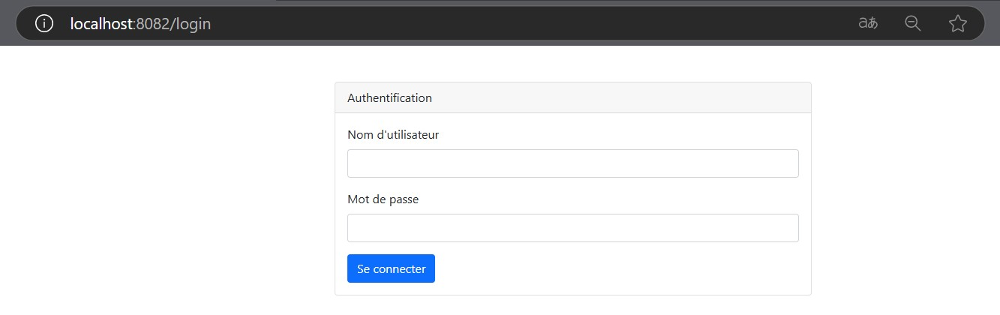
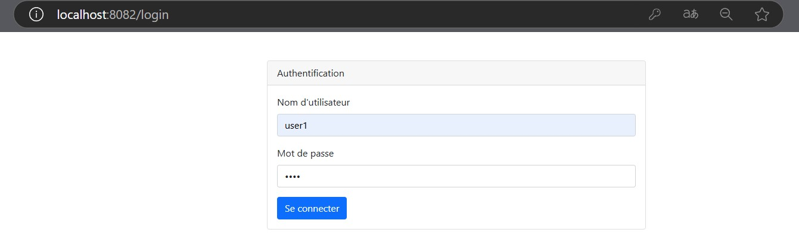
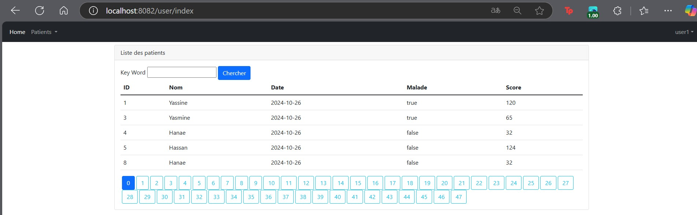
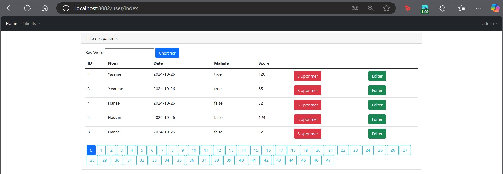
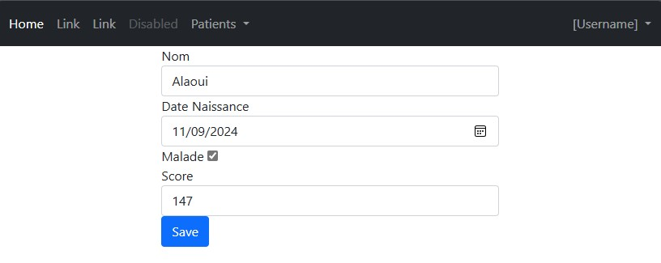
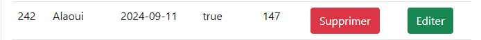
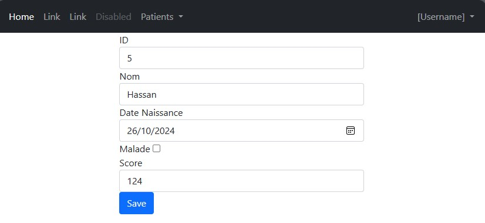
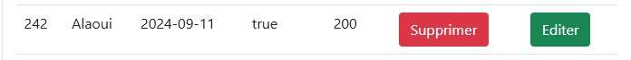

<h1>Spring MVC - Gestion des patients</h1>
<h2>Page Login</h2>

<h2>Page Login User</h2>

<h2>Page Home User</h2>

<h2>Page Home Admin</h2>

<h2>L'ajout d'un nouveau patient</h2>

<h2>Affichage du nouveau patient ajouté</h2>

<h2>Modification des données de l'un patient</h2>

<h2>Affichage du patient modifié</h2>

