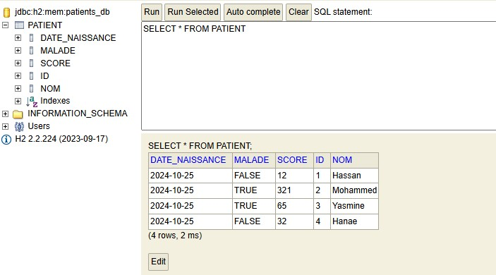
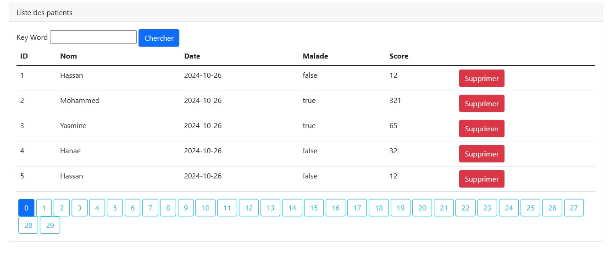
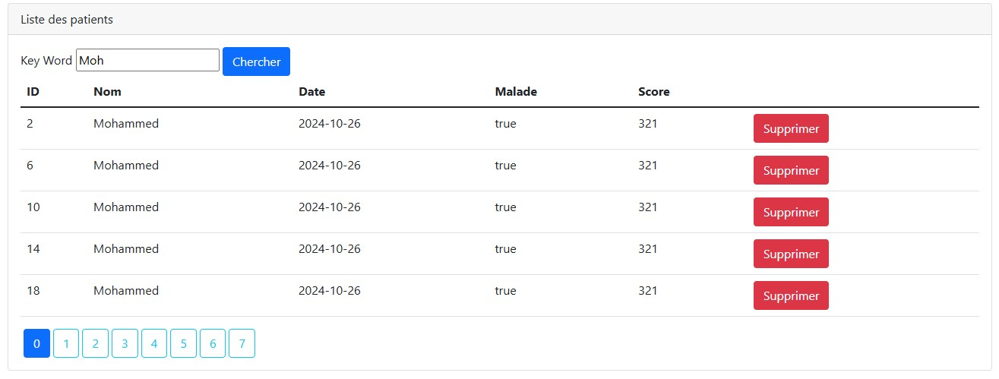
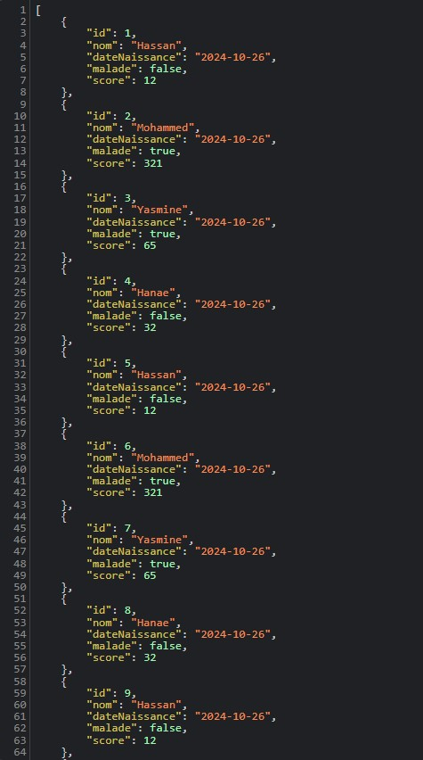

<h1>Spring MVC - Gestion des patients</h1>
<h2>Affichage de la liste des patients avec la base de donnees H2</h2>

<h2>Affichage de la liste des patients en utilisant la base de donnees MySQL</h2>

<h2>Rechercher les patients par mot cle</h2>

<h2>Alerte de suppression</h2>

<h2>Affichage de la liste des patients en format JSON</h2>
