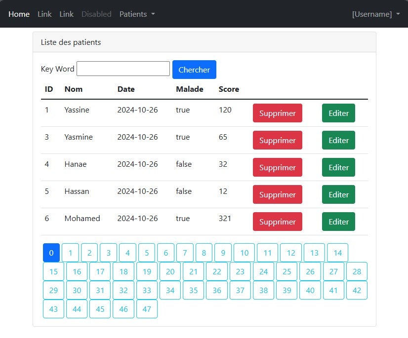

<h1>Spring MVC - Gestion des patients</h1>
<h2>Affichage de la liste des patients avec la base de données H2</h2>

<h2>Affichage de la liste des patients en utilisant la base de données MySQL</h2>

<h2>Rechercher les patients par mot clé</h2>

<h2>Alerte de suppression</h2>

<h2>Affichage de la liste des patients en format JSON</h2>

<h2>Affichage de l'index</h2>

<h2>L'ajout d'un nouveau patient</h2>

<h2>Affichage du nouveau patient ajouté</h2>

<h2>Modification des données de l'un patient</h2>

<h2>Affichage du patient modifié</h2>
